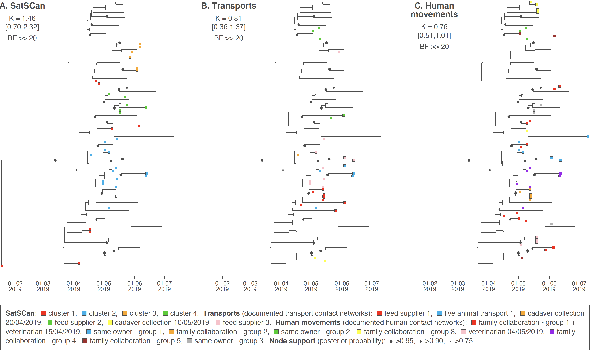

This repo gathers the input files and scripts related to our study entitled "**Combining phylogeographic analyses and epidemiological contact tracing to characterize an atypically highly pathogenic H3N1 avian influenza epidemic (Belgium, 2019)**" ([Van Borm\*, Boseret\*, Dellicour\* *et al*. 2023](https://wwwnc.cdc.gov/eid/article/29/2/22-0765_article), *Emerging Infectious Diseases*). R scripts related to the analyses are all gathered within the file `R_script_H3N1_study.r`.

Abstract: The high economic impact and zoonotic potential of avian influenza call for detailed investigations of dispersal dynamics of epidemics. We integrated phylogeographic and epidemiologic analyses to investigate the dynamics of a low pathogenicity avian influenza (H3N1) epidemic that occurred in Belgium during 2019. Virus genomes from 104 clinical samples originating from 85% of affected farms were sequenced. A spatially explicit phylogeographic analysis confirmed a dominating northeast to southwest dispersal direction and a long-distance dispersal event linked to direct live animal transportation between farms. Spatiotemporal clustering, transport, and social contacts strongly correlated with the phylogeographic pattern of the epidemic. We detected only a limited association between wind direction and direction of viral lineage dispersal. Our results highlight the multifactorial nature of avian influenza epidemics and illustrate the use of genomic analyses of virus dispersal to complement epidemiologic and environmental data, improve knowledge of avian influenza epidemiologic dynamics, and enhance control strategies.

**Figure: analysis of the phylogenetic signal associated with three covariates in study combining phylogeographic analyses and epidemiologic contact tracing to characterize the atypically pathogenic avian influenza (H3N1) epidemic, Belgium, 2019.** We assessed the phylogenetic signal associated with 3 covariates: **A**) Spatiotemporal SaTScan clusters (https://www.SaTScan.org); **B**) transport contact networks; **C**) social contact networks. Tree tip nodes are colored on the basis of the cluster or network to which they belong. For each covariate, we also report the estimated Blomberg K statistic and associated 95% highest posterior density interval (in parentheses) and BF support. BF, Bayes factor; ≫, much greater than.
